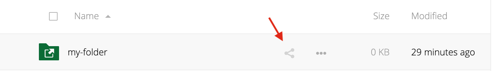
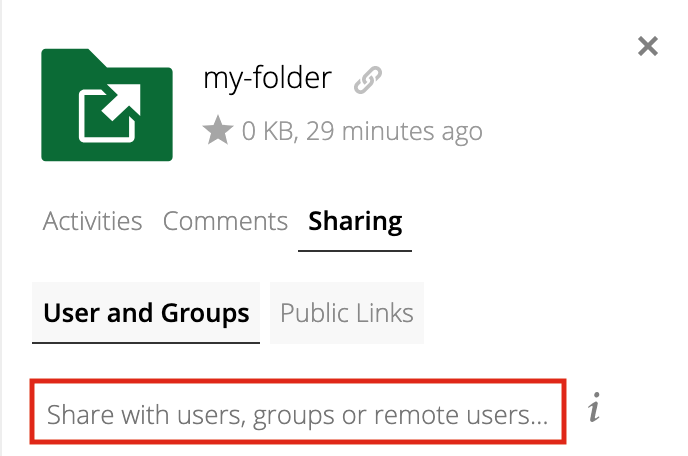
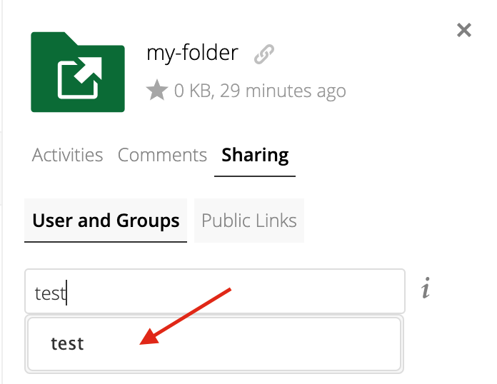
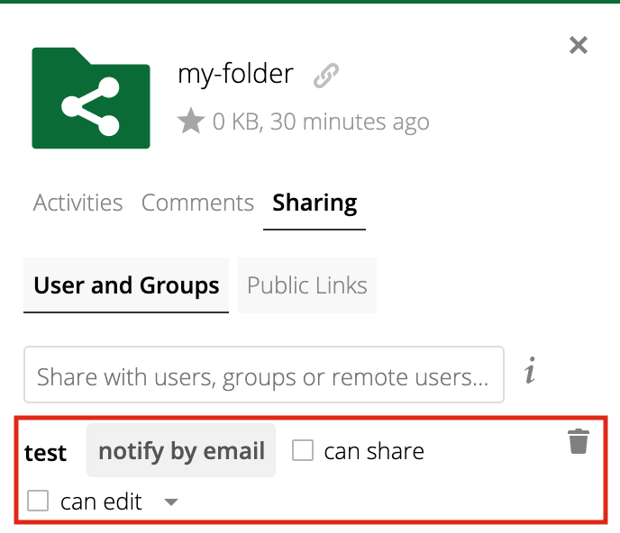
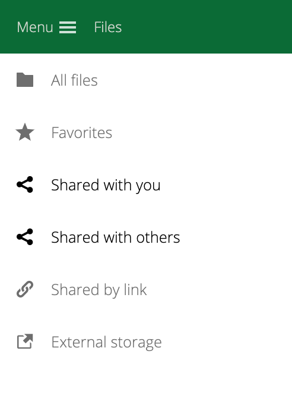

Collaborative Organisations
======================================

.. sidebar:: Video tutorials:
    
    * `How to create a CO <https://researchdrive.surfsara.nl/index.php/s/aiGfkxLByUY2UKa>`_
    * `How to invite a member to a CO <https://researchdrive.surfsara.nl/index.php/s/45XAPpoa4uAAAOW>`_

What is a collaborative organisation (CO)
------------------------------------------

Research Cloud is a platform for supporting research by working together with selected tools and data in workspaces. Working together is done with Collaborative Organisations. These are ad-hoc groups of people you can make or join to work together on a given research. The concept of the CO comes from Science `Collaboration Zone (SCZ)  <https://wiki.surfnet.nl/display/SCZ/Science+Collaboration+Zone+Home>`_. People are invited into COs based on information given by their identity provider (IdP). Different types of IdPs supported by SCZ are institute IdPs through SURFconext, or internationally through EDUgain, or for example social IdPs like google and outlook.

How are COs used in Research Cloud
-----------------------------------

In the Research Cloud portal you can view the COs you are a member of under the `my profile` menu. All the members of the CO are listed. When you start a workspace the first thing you do is choose whether you run it for a specific CO, or choose to run it as a private workspace. Private workspaces are explained in another part of the documentation. After choosing the CO the user can choose an application and in a step later a dataset. The item from the catalog that are shown are filtered based on the chosssen CO. A catalog item admin can choose which COs have access to the items he manages.

When you have started a workspace for a CO, all members of that CO will see the workspace in the active workpaces list. All members can access this workspace. The information that is put into the CO, either in SCZ or the research cloud portal, such as the SSH key andd the Time-based One-time Password (TOTP) link setup by the user, are used to create accounts and authentication methods for entering the workspace. This means the workspace is shared between the CO members for working together. 

.. Refer to persistent storage

How to request a new CO
-------------------------

A new CO can be requested by using the `request` button on the new CO part of of the Profile page in Research Cloud. You can then follow the steps and a new CO will be created in SCZ. You will receive an e-mail after the CO is created with a link that you can follow to manage the CO in SCZ. 

You are likely unable to see your CO in the Research Cloud portal just yet. You can follow these steps:

1. Log into SCZ (e.g.: by following the link to your CO when you requested its creation, or by going to: https://comanage.pilot.scz.lab.surf.nl)
2. On the left-column menu, choose "Collaborations"
3. On the list, choose the CO that you want to make visible in Research Cloud
4. On the left-column menu, choose "Configuration"
5. For every row in the table, click on "Reprovision all"
6. Go to Research Cloud, to the profile page and press the "*Reload Collaborative Organisations*"

After the CO is created you can invite users into your CO from the SCZ user interface.

We will explain the procedure to create persistent CO storage for this CO in ResearchDrive. Details about this storage are explained in the next paragraph.

Persistent CO storage
-------------------------

The workspaces started in Research Cloud are volatile in the standard flow. For saving results and getting data to the workspace we provide a ressearchdrive folder to all COs. After enrolling a new member into your CO you can share the Research Drive CO folder with them inside the ResearchDrive user interface.

In the chapter 'Setting up your account' is a description how to add your ResearchDrive account information to Research Cloud. This information can be used to link your ResearchDrive to the workspaces you enter.  After doing this you have to link the information to the COs you are a member of to make it active for worksspace of this CO. Every user has his own researchDrive linked, and you can work together in the shared folder.

To share the Research Drive folder with others:

- Log in to your Research Drive account on https://researchdrive.surfsara.nl/

- Find the folder you wish to share and click the triangular icon to the right of the folder name

- A panel like the one below will appear on the right side:  

- Start typing, in the search bar, the name of the user you wish to share the folder with and, once it appears as a result below the search bar, click it:  

- This will share the folder with the user and show a new menu with options below. Click "notify by email" to send an email to the user. Toggle "can edit" to allow the user to modify the contents of the folder:

- You should now be able to view the folder in the "Shared with others" section of the sidebar:

